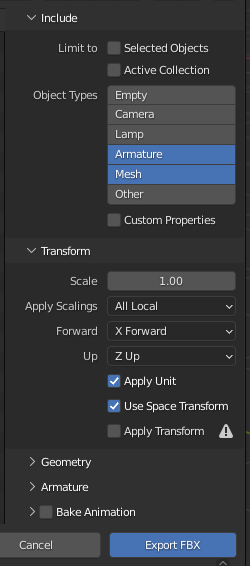
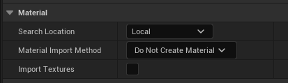

# Adding a New Vehicle to Carla Unreal Engine 5

## Links
Reading
* [Carla UE5 Docs](https://carla-ue5.readthedocs.io/en/latest/)
* [CarlaDocs: Content authoring - vehicles](https://carla-ue5.readthedocs.io/en/latest/tuto_content_authoring_vehicles/)
* [UE4 Add vehicle to Carla](https://www.youtube.com/watch?v=0F3ugwkISGk) (Even though this video is for adding a vehicle into UE4, it was still very helpful as the process for UE5 is similar.)

Possibly helpful Videos for the future
* [UE4 Adding Trailer to Vehicle](https://www.youtube.com/watch?v=mJufrK7RkeI)


## Software Used
* `blender v3.0.1`
* `carla v0.10.0`
* `UnrealEngine v5.5`


## Process
*Generally was able to follow the Carla Docs and the video for adding a vehicle. Below are the things I changed, or just had to figure out where the docs were vague or unclear.*

Note: This is the process I followed for adding the [kenworthTruck_Old.fbx](../models/kenworth_trucks/kenworthTruck_Old.fbx). Which already had the bones rigged up. I essentially started my work from `07:30` in the [UE4 Add vehicle to Carla](https://www.youtube.com/watch?v=0F3ugwkISGk) video. Following the carla docs starting at the "Export" heading, down. The part of the Docs above that heading seemed right and were helpful to understand, but I did not do them myself to get the KenworthTruck model working as the FBX model I was given already had the bones rigged up for the wheels and body.

1. Imported `kenworthTruck_Old.fbx` into Blender.
    * Deleted a lot of the materials, see [Crash on Import](#unreal-editor-crashes-trying-to-import-kenworthtruckfbx). Left 6 materials: `Metal_Coated_tqm`, `Tire_tqm`, `Glass_Glossy_Orange`, `Car_Paint_tqm`, `Glass_Basic_tqm`, and `Glass_Black_tqm`.
    * Added bone constraints to the wheels to make sure they stay in position and only rotate the expected directions. See [UE4 Add vehicle to Carla](https://www.youtube.com/watch?v=0F3ugwkISGk) at time `07:30`.
    * Exported as [kenworthTruck_Updated.fbx](../models/kenworth_trucks/kenworthTruck_Updated.fbx) with these settings  
    
    * I did not have any seperate doors, glass, lights, raycast mesh,  or collision mesh made in blender. Only had the bodywork/chassis with wheels to export

2. Importing Truck into CarlaUE5
    * Set the file filter to `FBX skeletal meshes(*.fbx)`, this makes sure the right import settings shwo up when you pick your file.
    * I used all of the default settings, and clicked `Import All`.

3. Setting Vehicle up
    * I followed the CarlaDocs almost to the letter here, skipping a couple parts for the doors and lights which I did not make for the Kenworth Truck.
    * Changing Materials: I found that CarlaUE5 had some really good vehicle materials that come with it.
        * Replaced some of the materials with the better ones.
            * `Metal_Coated_tqm` -> `BrushedAluminiumBlack_Inst`
            * `Tire_tqm` -> `Rubber_Inst`
            * `Car_Paint_tqm` -> `MI_Blue`
            * `Glass_Basic_tqm` -> `MI_Glass`
    * I used the automatic collision mesh generation, with the Multi-convex hull.
    * Vehicle Movement Component
        * Was able to follow docs here and they worked. I will likely need to go back and figure out a more accurate Torque Curve graph, as I just made one up for it to work.
        * I need to do more research as I only have a basic understanding of the Torque curve and gear ratios settings, so I left the gears as default settins for now. Later could alter those settings to more accurately simulate the real life performance of the Kenworth truck.
        * I just looked up average mass, width, and height for a kenworth 6-wheeler, and used that for the last step.

4. Accessing Vehicle to load for manual control on client side
    * The accessor from the client side when you make a csv file for your vehicle, see [kenworth.csv](../input/examples/kenworth.csv), is as follows `vehicle.MAKE.MODEL`. Ie. `vehicle.kenworth.truck` is what loaded the kenworth truck. The Make and Model fields are set when editting `VehicleParameters.json`.
    * The docs do not really say much about this for Carla UE5. You need to add your vehicle to `VehicleParameters.json` located `~/CarlaUE5/Unreal/CarlaUnreal/Content/Carla/Config`.
    * My added entry for the Kenworth Truck.
        ```json
        {
            "Make": "kenworth",
            "Model": "truck",
            "Class": "/Game/Carla/Blueprints/Vehicles/KenworthTruck/BP_KenworthTruck.BP_KenworthTruck_C",
            "NumberOfWheels": 4,
            "Generation": -1,
            "ObjectType": "",
            "BaseType": "truck",
            "SpecialType": "",
            "HasDynamicDoors": false,
            "HasLights": false,
            "RecommendedColors": [
                {
                    "R": 0,
                    "G": 0,
                    "B": 0,
                    "A": 0
                }
            ],
            "SupportedDrivers": []
        }
        ```


## Errors
*These are errors and fixes encountered during setup. Hopefully you will find them helpful.*
### Unreal Editor crashes trying to import `KenworthTruck.fbx`
* Crash Report from Unreal Editor
    ```
    LoginId:801c24400ce14c3ab9a8ebfda8e62a7e-000003ee

    Assertion failed: ResourceIndex < State.MaxDescriptorCount [File:./Runtime/VulkanRHI/Private/VulkanDescriptorSets.cpp] [Line: 890] 
    You need to grow the resource array size for [VK_DESCRIPTOR_TYPE_UNIFORM_TEXEL_BUFFER]!
    ```

* [Forum on similar issue](https://forums.unrealengine.com/t/ue5-2-freezes-on-importing-fbx/1263565/2?page=2)
* I tested importing a very simple FBX of just the default cube on Blender startup. This did work. The issue seems to be with the kenworth FBX file specifically.

#### Attempted Fixes
1. Stuff I am reading with chatGPT saying that the issue could be with the Nvidia and Vulkan drivers. Which the one recommended by `sudo ubuntu-drivers devices` is newer than the one being used on this machine.
    * Updated nvidia to `driver   : nvidia-driver-570 - third-party non-free recommended`
    * No change, still same error upon attempt to import.
    ---     
2. Loaded the original FBX file into Blender. Tried adding a "decimate" modifier to the truck in Blender, which was supposed to simplify it. Then exported it again.
    * Changed ratio to `0.75`
    * Did the `triangulate` option which makes all mesh shapes triangles to simplify as well.
    * Still failed to import.
    ---

3. Tried exporting it with those changes again, but looked closer at the settings of the export. 
    * Not sure what I changed, but the truck still looked pretty good, and this time the exported FBX is much smaller than the original, it is `20Kb`, instead of the original FBX file which is `40Mb`.
    ---
    
4. `[2025.05.08-22.42.18:716][722]r.GpuProfilerMaxEventBufferSizeKB = "1024"` ran this in the Unreal Console to increase the buffer size.
    * Still failing. I am thinking maybe I need to look more into the import settings for bringing in the file, I might be doing something wrong.
    ---  

5. Ran `sudo apt install vulkan-tools libvulkan1`
    * Console said they were already at the latest version.
    * Tried again, still the same error.
    ---

6. Editting file in Carla UE5 source code to increase the size of the buffer
    * I modified line 890 to be the following (just added more text to see what the size of `State.MaxDescriptorCount` actually is)
    * `checkf(ResourceIndex < State.MaxDescriptorCount, TEXT("You need to grow the resource array size for [%s]! State.MaxDescriptoCount=%d"), VK_TYPE_TO_STRING(VkDescriptorType, State.Descri    ptorType), State.MaxDescriptorCount);`
    * Result: `You need to grow the resource array size for [VK_DESCRIPTOR_TYPE_UNIFORM_TEXEL_BUFFER]! curr_size=65536`. I did not find a way to actually increase the buffer size. Also I am giving up on this as I think this will not actually be a good fix.
    ---

7. Tried importing Kenworth truck without the material
    * Imported as `FBX skeletal meshes` file type.  
    
    *Settings to exclude materials in the import.*
    * I kept the other settings as the defaults.
    * I even undid the decimate modifier to unsimplify the truck and it imported fine as long as I did not include the material.
    * I also tried it including the textures and the import still worked.
    * Result: This import worked! It brought in the truck.  
        * The issue is specifically with the truck material, possible being too complex or my thought is that it is in some format not compatible with UE5.
    ---

8. Deleted some materials that did not seem to be used for much
    * I deleted down to 6 materials
    * Result: I was able to import the truck and it's materials!

#### Fixed
Deleting the materials worked. I have the Kenworth Truck imported.
* It seems that the kenworth truck FBX had a lot of different materials compared to the vehicles in carla which had around 6, give or take a few. I believe that ws the issue, just too many materials.
* Later I also found that Carla includes some basic vehicle materials which can be used on added vehicles, I switched most of the Kenworths used materials to be these as they honestly look nicer than the ones I imported.

### Can't figure out how to access the new Kenworth
#### Attempted Fixes
Looking for the actual file where the list of vehicle blueprints is defined.
* The location of the factory c++ files
    * `~/CarlaUE5/Unreal/CarlaUnreal/Plugins/Carla/Source/Carla/Actor/Factory$`
* The Location of the Json config files
    * `~/CarlaUE5/Unreal/CarlaUnreal/Content/Carla/Config`

#### Fixed
* I found the file!
* Just had to add my created vehicle to the json file. After doing so, the kenworth truck loaded up on the client side!
* Note the accessor from the client side when you make a csv file for your vehicle is as follows `vehicle.MAKE.MODEL` ie `vehicle.kenworth.truck` is what loaded the truck.
* Added the following to `VehicleParameters.json`
    ```json
    {
        "Make": "kenworth",
        "Model": "truck",
        "Class": "/Game/Carla/Blueprints/Vehicles/KenworthTruck/BP_KenworthTruck.BP_KenworthTruck_C",
        "NumberOfWheels": 4,
        "Generation": -1,
        "ObjectType": "",
        "BaseType": "truck",
        "SpecialType": "",
        "HasDynamicDoors": false,
        "HasLights": false,
        "RecommendedColors": [
            {
                "R": 0,
                "G": 0,
                "B": 0,
                "A": 0
            }
        ],
        "SupportedDrivers": []
    }
    ```

### Truck spawns in but cannot move
* The Kenworth truck stays floating above the ground once spawned in, and the wheels do not move when throttle pushed or steering wheel turned.

#### Attempted Fixes
1. I deleted all of the Kenworth truck files. Going to retry the import/setup process now that I understand it better. I think the issue is just some issue in how it was setup. I must have missed something.
    * I had just assumed this part was done. I just added the bone constraints to the four wheel bones, so they don't move and they rotate how they are supposed to. Maybe this caused and issue?
    * I was shown a weight setting that I do not think I activated before, maybe that will fix floating?
    * Also there is an error showing up about missing bone ends? I don't think there was anything in the documentation on this. Will need to see if it matteres.
    * Tire measurements:
        * Width 30cm
        * Radius 42cm
    * Result: 

#### Fixed
* I just followed the Carla documentation again carefully. It drives now.