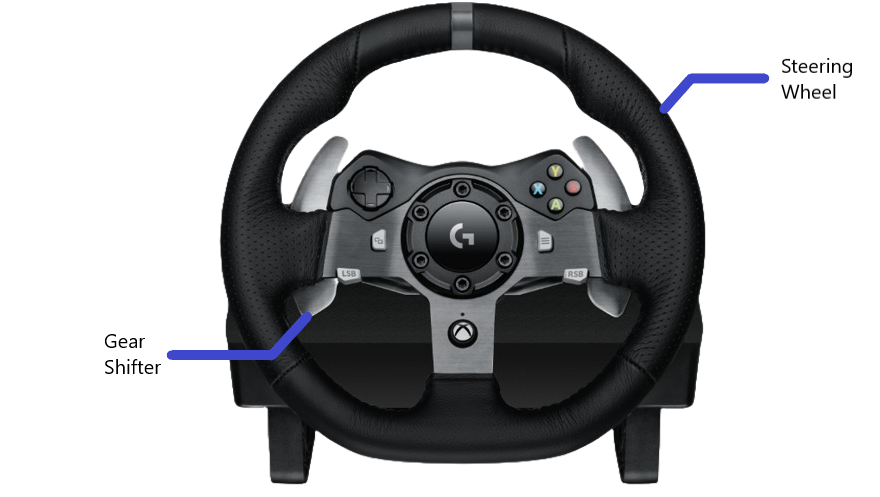

# How to drive
* Turn the steering wheel to turn the car
* Press the gas pedal to accelerate the car
* Press the brake pedal to decelerate
* Pull the left gear shifter towards you to toggle between drive and reverse