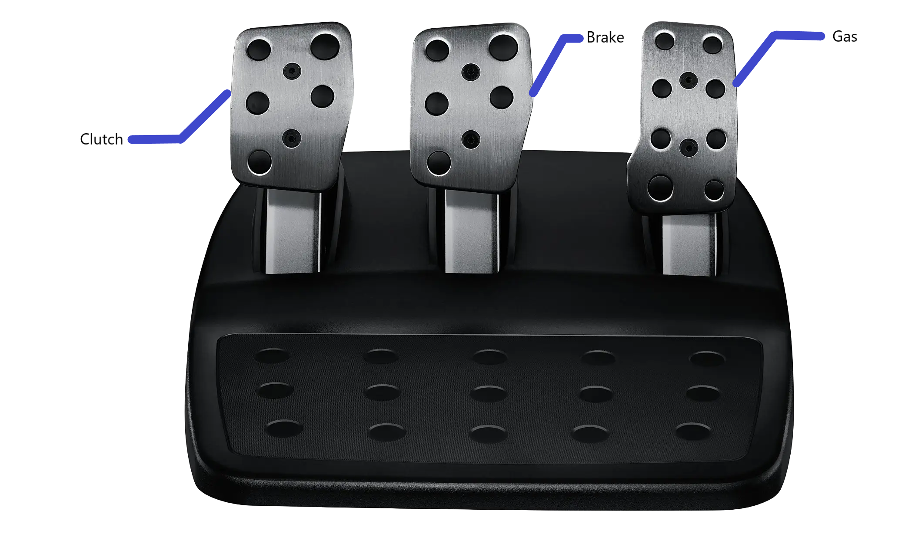

# How to drive
* Turn the steering wheel to turn the vehicle
* Press the gas pedal to accelerate the vehicle
* Press the brake pedal to decelerate
* Pull the gear shifter to switch to and from drive and reverse