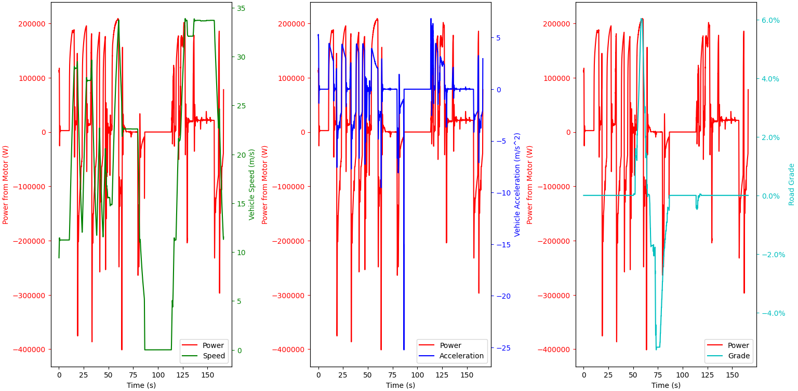

# trackers
Energy consumption tracking for CARLA simulator.


## Contents
- [charger.py](charger.py) is a class for wireless chargers.
- [consumption.md](consumption.md) contains notes from research.
- [energy_tracker.py](energy_tracker.py) tracks EV energy consumption.
    - Verification: Run `python test_energy_tracker.py`.
- [ev.py](ev.py) contains a data class with info about a specific EV.
- [example.py](example.py) shows a usage example. This spawns traffic and tracks energy usage and other data about a simulated Tesla Model 3, displaying updates every second. At the end, it graphs the power consumed as compared with velocity, acceleration and road grade, then plots a heatmap of the areas the vehicle travelled to. 
    - Run `python example.py -h` to get all options.
- [kinematics_tracker.py](kinematics_tracker.py) tracks vehicle location, speed, acceleration, road grade, and distance travelled.
- [soc_tracker.py](soc_tracker.py) adds state of charge and wireless charging functionalities to an `EnergyTracker`. 
- [time_tracker.py](time_tracker.py) tracks simulation time.
- [tracker.py](tracker.py) is a base class for `Tracker`s. 

- [input/](input/README.md) contains example input files for [example.py](example.py).


## Requirements
Follow CARLA installation instructions for both server and client. This code was tested on CARLA `v0.9.14`, Python `v3.8.16`.


## Basic Usage
1. Start the CARLA server.
2. Run `python example.py`.


## Results
Results appear comparable between trials, but time step length does affect results.

### Baselines
#### Tesla Model 3 without traffic, Town10 (`python example.py -s 0 0 0 -n 1 -t 0.01 -r n`): 
Trial 1:
```
After 8026.84 s:
        Distance travelled: 68144.8 m
        Average speed: 8.48962 m/s (30.5626 km/h) (18.9908 mph)
        Speed: 0.00039747739642766655 m/s
        Acceleration: -0.0018180440064522213 m/s^2
        Energy consumed: 9.87369 kWh
        Energy efficiency: 0.000144893 kWh/m (14.4893 kWh / 100 km) (23.3182 kWh / 100 mi)
```

#### Tesla Model 3 without traffic, Town10 (`python example.py -s 0 0 0 -n 1 -t 0.025 -r n`): 
Trial 1:
```
After 8016.68 s:
        Distance travelled: 62458.2 m
        Average speed: 7.79104 m/s (28.0477 km/h) (17.4281 mph)
        Speed: 9.424250692497838 m/s
        Acceleration: -1.7254488608855567 m/s^2
        Energy consumed: 6.88879 kWh
        Energy efficiency: 0.000110294 kWh/m (11.0294 kWh / 100 km) (17.7501 kWh / 100 mi)
```
Trial 2:
```
After 8023.03 s:
        Distance travelled: 65224 m
        Average speed: 8.12961 m/s (29.2666 km/h) (18.1855 mph)
        Speed: 11.236554141221145 m/s
        Acceleration: -0.0009344174249563076 m/s^2
        Energy consumed: 7.1042 kWh
        Energy efficiency: 0.00010892 kWh/m (10.892 kWh / 100 km) (17.5289 kWh / 100 mi)
```
Trial 3:
```
After 8019.8 s:
        Distance travelled: 61753.4 m
        Average speed: 7.70012 m/s (27.7204 km/h) (17.2247 mph)
        Speed: 9.597222406761126 m/s
        Acceleration: -1.7536880222205058 m/s^2
        Energy consumed: 6.79009 kWh
        Energy efficiency: 0.000109955 kWh/m (10.9955 kWh / 100 km) (17.6955 kWh / 100 mi)
```

#### Tesla Model 3 without traffic, Town10 (`python example.py -s 0 0 0 -n 1 -t 0.05 -r n`):
Trial 1:
```
After 8027.45 s:
        Distance travelled: 65912.4 m
        Average speed: 8.21088 m/s (29.5592 km/h) (18.3673 mph)
        Speed: 11.216957929709446 m/s
        Acceleration: 0.22195622289959355 m/s^2
        Energy consumed: 8.26933 kWh
        Energy efficiency: 0.000125459 kWh/m (12.5459 kWh / 100 km) (20.1907 kWh / 100 mi)
```
Trial 2:
```
After 7994.95 s:
        Distance travelled: 67260.4 m
        Average speed: 8.41287 m/s (30.2863 km/h) (18.8191 mph)
        Speed: 11.22324687363154 m/s
        Acceleration: -0.15307171697385238 m/s^2
        Energy consumed: 8.44153 kWh
        Energy efficiency: 0.000125505 kWh/m (12.5505 kWh / 100 km) (20.198 kWh / 100 mi)
```
Trial 3:
```
After 8005.15 s:
        Distance travelled: 66599.5 m
        Average speed: 8.31958 m/s (29.9505 km/h) (18.6104 mph)
        Speed: 11.22871603291339 m/s
        Acceleration: 0.21664034086128492 m/s^2
        Energy consumed: 8.36104 kWh
        Energy efficiency: 0.000125542 kWh/m (12.5542 kWh / 100 km) (20.204 kWh / 100 mi)
```

### Traffic
#### Tesla Model 3 with 50 vehicles, Town10 (`python example.py -s 0 0 0 -n 50 -t 0.05 -r n`): 
Trial 1:
```
After 8024.65 s:
        Distance travelled: 35560.9 m
        Average speed: 4.43146 m/s (15.9533 km/h) (9.91292 mph)
        Speed: 4.989018251080677 m/s
        Acceleration: -1.3857614169289407 m/s^2
        Energy consumed: 6.00395 kWh
        Energy efficiency: 0.000168836 kWh/m (16.8836 kWh / 100 km) (27.1714 kWh / 100 mi)
```

### Hills
#### Tesla Model 3 without traffic, Town03 (`python example.py -s 0 0 0 -n 1 -t 0.025 -r n`): 26.9 kWh / 100mi
Trial 1:
```
After 8022.25 s:
        Distance travelled: 39796 m
        Average speed: 4.9607 m/s (17.8585 km/h) (11.0968 mph)
        Speed: 11.247537498363451 m/s
        Acceleration: -0.17083164705338488 m/s^2
        Energy consumed: 6.69271 kWh
        Energy efficiency: 0.000168176 kWh/m (16.8176 kWh / 100 km) (27.0652 kWh / 100 mi)
```
*Roughly 2 dozen hills (> 5% grade, up to 40%) ascended/descended.*

### Highway
#### Tesla Model 3 without traffic, Town04 (`python example.py -s 0 0 0 -n 1 -t 0.05 -r n`):
Trial 1:
```
After 8024.28 s:
        Distance travelled: 180856 m
        Average speed: 22.5386 m/s (81.1389 km/h) (50.4175 mph)
        Speed: 20.036752195228406 m/s
        Acceleration: -2.9308030255663606 m/s^2
        Energy consumed: 40.3028 kWh
        Energy efficiency: 0.000222845 kWh/m (22.2845 kWh / 100 km) (35.8633 kWh / 100 mi)
```
*Roughly 5 dozen laps, up to 6% grade.*

A plot of the first lap around the highway: 

## Simulation Options
For an idea of how fast the simulation will run:

### Epic Mode Rendering
```python example.py -s 0 0 0 -n 1 -t 0```

100 simulation seconds in 100 real seconds.

```python example.py -s 0 0 0 -n 1 -t 0.025```

222 simulation seconds in 100 real seconds

```python example.py -s 0 0 0 -n 1 -t 0.025 --asynch```

217 simulation seconds in 100 real seconds

```python example.py -s 0 0 0 -n 1 -t 0.01```

86 simulation seconds in 100 real seconds

```python example.py -s 0 0 0 -n 1 -t 0.05```

440 simulation seconds in 100 real seconds

```python example.py -s 0 0 0 -n 100 -t 0.025```

124 simulation seconds in 100 real seconds

### Low Mode Rendering
```python example.py -s 0 0 0 -n 1 -t 0.025```

345 simulation seconds in 100 real seconds

### Off-Screen Rendering
```python example.py -s 0 0 0 -n 1 -t 0.025```

234 simulation seconds in 100 real seconds

### No Rendering
```python example.py -s 0 0 0 -n 1 -t 0.01 -r n```

851 simulation seconds in 100 real seconds

```python example.py -s 0 0 0 -n 1 -t 0.025 -r n```

2054 simulation seconds in 100 real seconds

```python example.py -s 0 0 0 -n 1 -t 0.05 -r n```

4002 simulation seconds in 100 real seconds
